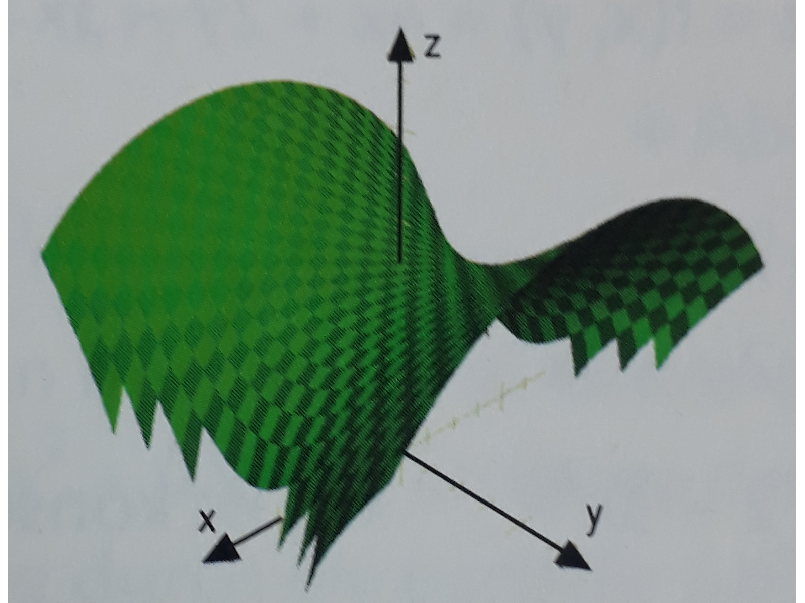

# Mathe yeah ig
## 1. patielle ableitung
**beispiel:**
$$
f(x, y)=y\,e^{y\sqrt[5]{x^{3}}}
$$
maxima befehl:
```maxima
f: y*exp(y * x^(3/5));
```
für partielle ableitung einfach ableitung machen und die anderen variablen als konstanten betrachten (wenn f(x,y)=... dann x, y unabhängig, f abhängig,  alle anderen als konstanten betrachten)
also
x: unabhängige variable
y: unabhängige variable
f: abhängige variable
e: konstante
ableitun sollte man können (auch händisch)
```maxima
diff(f, x); /* partielle ableitung nach x */
diff(f, y); /* partielle ableitung nach y */
```
ergebnis:
```maxima
/* partielle ableitung nach x */
(%o1)	(3*%e^(x^(3/5)*y)*y^2)/(5*x^(2/5))
/* partielle ableitung nach y */
(%o2)	%e^(x^(3/5)*y)*x^(3/5)*y+%e^(x^(3/5)*y)
```
also
$$
% nach x:
\frac{\partial f}{\partial x}=\displaystyle \frac{3 e^{\left(\sqrt[5]{x^3} y\right)} y^2}{5 \sqrt[5]{x^2}}
$$
$$
% nach y:
\frac{\partial f}{\partial y}=\displaystyle e^{\left(\sqrt[5]{x^3} y\right)} + y e^{\left(\sqrt[5]{x^3} y\right)} {\sqrt[5]{x^3}}
$$

### random ass Begriffe
- **partielle ableitung:** ableiten nach nur 1* variable (wird als **f<sub>x</sub>**; **f<sub>y</sub>**; **f<sub>yy</sub>**, ... notiert)
- **stetig:** Kein plötzlicher Sprung; nähert man sich einer Stelle, nähert sich auch der Funktionswert langsam.
- **differenzierbar:** An der Stelle lässt sich die Kurve durch eine einzige Gerade gut annähern — kein scharfes Eck.
- **unabhängige variable:** Eingabe, die du verändern kannst.
- **abhängige variable:** Ausgabe, die sich je nach Eingaben ändert.
- **konstante:** Ein Wert, der während der Betrachtung unverändert bleibt.
- **gemischt partielle ableitung:** Zuerst nach einer Variablen ableiten, dann nach einer anderen. (**f<sub>xy</sub>** oder **f<sub>yx</sub>**, ... also **f<sub>xy</sub>** =  zuerst nach x, dann nach y ableiten)
- satz von schwatz: wenn funktion stetig und differenzierbar, dann ist die reihenfolge der ableitungen egal (**f<sub>xy</sub>=f<sub>yx</sub>**)

### darstellung von 3d funktionen
z=sqrt(25-x^2+y^2)<br>
wenn x=0, y=0 dann z=5 (mittelpunkt bei höhe 5)<br>
da **x^2 negativ** ist, schaut die funktion im **verlauf der x achse** ╭╮ aus<br>
da **y^2 positiv** ist, schaut die funktion im **verlauf der y achse** ╰╯ aus


mach das:
[Definition und Visualisierung](https://elearning.tgm.ac.at/mod/quiz/view.php?id=17045)


## 2. extremstellen
**2d**
fx=0 --> lokale extremstellen (hoch/tiefpunkte/sattelpunkt)<br>
fxx>0 --> tiefpunkt<br>
fxx<0 --> hochpunkt<br>
fxx=0, fxxx!=0 --> wendepunkt<br>
**3d**
fx=0, fy=0 --> lokale extremstellen (hoch/tiefpunkte/sattelpunkt)<br>
D=fxx*fyy-(fxy)^2<br>
D>0, fxx>0 --> tiefpunkt<br>
D>0, fxx<0 --> hochpunkt<br>
D<0 --> sattelpunkt<br>
D=0 --> keine aussage möglich<br>

### random ass Begriffe
- sattelpunkt: Punkt, an dem die Funktion bei der x-Achse einen Hoch- oder Tiefpunkt hat und y achse das Gegenteil ist.
- wendepunkt: Punkt, an dem die Funktion ihre Krümmung ändert (zwischen hoch- und tief- punkt).
- extrempunkt: Punkt, an dem die Funktion ein Maximum oder Minimum erreicht.

mach test:
[Extremstellen](https://elearning.tgm.ac.at/mod/quiz/view.php?id=17046)
## 3. Regression
**lineare regression:** y=ax+b<br>
**quadratische regression:** y=ax^2+bx+c<br>
**exponentielle regression:** y=a*e^(bx)<br>

```maxima
/* daten eingeben */
daten: matrix([1,2],[2,3],[3,5],[4,4],[5,6]);
/* lineare regression durchführen */
lsquares_estimates(
    daten, /* datenpunkte and die angepasst werden muss*/
    [x,y], /* gegebene variablen */
    y=x*a+b, /* funktion die angepasst werden muss */
    [a, b] /* unbekannte variablen die gefunden werden müssen */
), numer;
```
ergebnis: 
```maxima
(%o1)	[[a=0.9,b=1.3]]
```
also y=0.9x+1.3

### random ass Begriffe
- **lineare regression:** Anpassung einer linearen Funktion an die Daten.
- **quadratische regression:** Anpassung einer quadratischen Funktion an die Daten.
- **exponentielle regression:** Anpassung einer exponentiellen Funktion an die Daten.
- anpassen: Die Methode zur Anpassung einer Funktion an die Daten.
- daten: Die Punkte, die zur Anpassung verwendet werden.
- unbekannte variablen: Die Parameter der Funktion, die angepasst werden müssen.
- anpassung: Der Prozess, bei dem die Funktion an die Daten angepasst wird.
- regression: Der Prozess der Anpassung einer Funktion an die Daten.
- überanpassung: Wenn die Funktion zu stark an die Daten angepasst wird und nicht mehr verallgemeinerbar ist.
- unteranpassung: Wenn die Funktion nicht ausreichend an die Daten angepasst wird und wichtige Trends verpasst.
  
mach test
[Regression](https://elearning.tgm.ac.at/mod/quiz/view.php?id=17047)


## 4 Fehlerrechnung ahkporithoyxcv (scheißedreck ist das)
Si einheiten (eher unwichtig):
- länge: meter (m)
- masse: kilogramm (kg)
- zeit: sekunde (s)
- stromstärke: ampere (A)
- temperatur: kelvin (K)
- stoffmenge: mol (mol)
- lichtstärke: candela (cd)
  
abgeleitete einheiten (unwichtig):
- leistung: watt (W) = kg·m²/s³
- frequenz: hertz (Hz) = 1/s
- beschleunigung: meter pro sekunde² (m/s²)
- kraft: newton (N) = kg·m/s²
- druck: pascal (Pa) = N/m² = kg/(m·s²)
- energie: joule (J) = N·m = kg·m²/s²
- ladung: coulomb (C) = A·s
- kapazität: farad (F) = C/V = A²·s⁴/(kg·m²)
- spannung: volt (V) = kg·m²/(A·s³)
- widerstand: ohm (Ω) = kg·m²/(A²·s³)
- induktanz: henry (H) = kg·m²/(A²·s²)


also basicly einheit ohne größe zb km --> m (außer bei kg da ist das k teil der einheit weil baum)

### fehler anhand besipiel
- schwankung in %
- schwankung in absoluten werten

$$
funktion: V(r,h) = r^2 \cdot \pi \cdot h
$$

% --> wert <br>
r=0.43m±5% --> 0.43m±(0.43m*0.05) --> 0.43m±0.0215m<br>
wert --> %<br>
h=0.7214m±0.02m --> 0.7214m±(0.02m/0.7214m) --> 0.7214m±2.77%<br>

### asbsoluter fehler
$$
% abs fehler=
% diff(V, r) --> werte einsetzen
absoluter\_fehler\_r = \left| \frac{\partial V}{\partial r} \right| \cdot \Delta r = \left| 2 \cdot r \cdot \pi \cdot h \right| \cdot \Delta r
$$

also ableitung dach r machen<br>
werte einsetzen<br>
und mit schwankung in absoluten werten multiplizieren<br>
absoluten wert nehmen (falls negativ einfach positiv machen)<br>
```maxima
V: r^2 * %pi * h;
absoluter_fehler_r: abs(subst([r=0.43, h=0.7214], diff(V, r))) * delta_r;
```
gemsamtfehler: summe aller absoluten fehler<br>
```maxima
gemsamtfehler: absoluter_fehler_r + absoluter_fehler_h
```
### Fehleranteil in %
$$
fehleranteil = \frac{absoluter\_fehler}{gesamter\_fehler} \cdot 100
$$
```maxima
fehleranteil_r_in_%: (absoluter_fehler_r / gesammtfehler) * 100
fehleranteil_h_in_%: (absoluter_fehler_h / gesammtfehler) * 100
```
### Tortendiagramm
```maxima
winkel_r: (fehleranteil_r_in_%/100) * 360;
winkel_h: (fehleranteil_h_in_%/100) * 360;
```
dann halt kreis zeichnen mit den winkel (so das der fehleranteil dargestellt wird)

### random ass Begriffe
- **absolute fehler:** Der Fehler, der durch die Unsicherheit in den Messungen verursacht wird.
- **relative fehler:** Der Fehler im Verhältnis zum gemessenen Wert.
- **gesamter fehler:** Die Summe aller Fehler in einer Berechnung.
- 

[Fehlerrechnung Test](https://elearning.tgm.ac.at/mod/quiz/view.php?id=17048)
## 5 wichtige Maxima befehle
```maxima
subst(variablen_ersetzen, ausdruck); /* variablen ersetzen */
subst([x=2, y=3], f); /* x durch 2, y durch 3 in f ersetzen */

diff(f, x, 1); /* erste partielle ableitung nach x */
diff(f, y, 2); /* zweite partielle ableitung nach y */
diff(f, x, 1, y, 1); /* gemischt partielle ableitung nach x und y */
diff(diff(f, y, 1), x, 1); /* gemischt partielle ableitung nach y und x (gleich wie oben nur andersgeschrieben) */


solve(gleichung, variable); /* gleichung nach variable auflösen */
solve(fx=0, x); /* gleichung fx=0 nach x auflösen */
solve([fx=0, fy=0], [x, y]); /* gleichungssystem nach x und y auflösen */
solve(y=x) /* gleichung y=x nach y auflösen (soweit wie möglich) */

find_root(gleichung, variable, startwert, endwert); /* numerische lösung einer gleichung */
find_root(sin(x)-x/2, x, 0, 3); /* numerische lösung der gleichung sin(x)-x/2 im intervall [0,3] */

integrate(ausdruck, variable); /* unbestimmtes integral */
integrate(x^2, x); /* unbestimmtes integral von x^2 nach*/

lsquares_estimates(
    daten, /* datenpunkte and die angepasst werden muss*/
    [x,y], /* gegebene variablen */
    y=funktion, /* funktion die angepasst werden muss */
    [unbekannte_variablen] /* unbekannte variablen die gefunden werden müssen */
), numer; /* numerische werte zurückgeben */
```